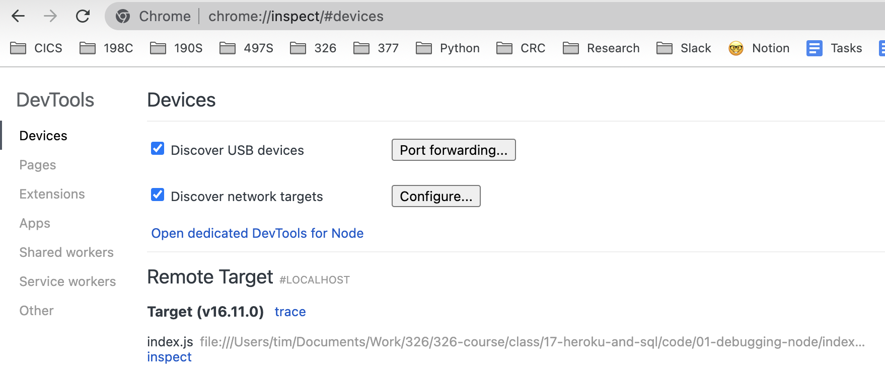
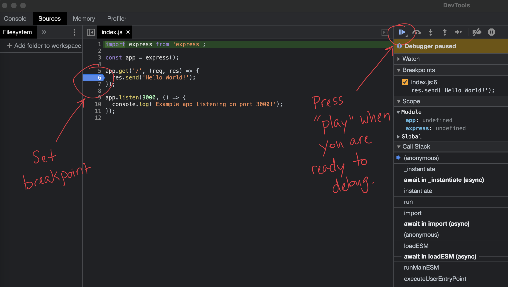
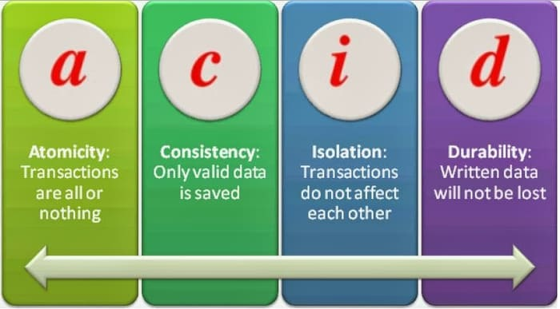
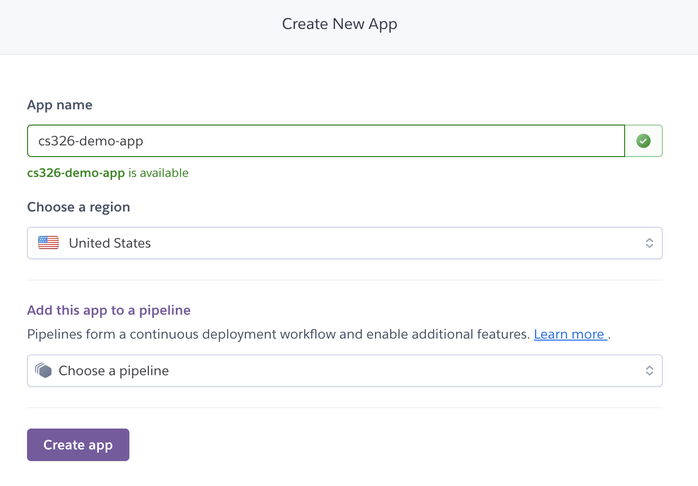
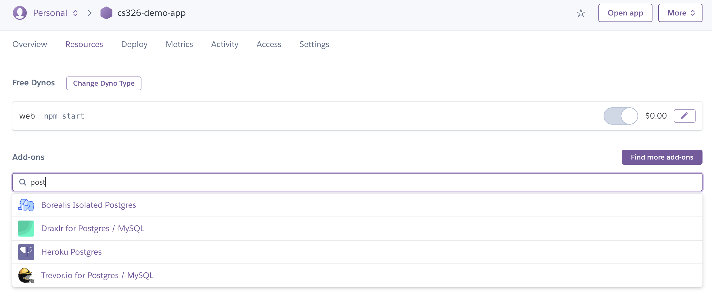
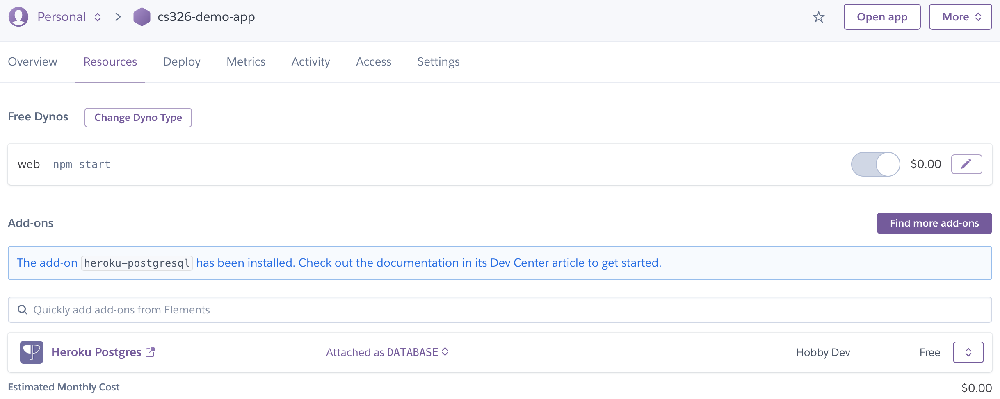
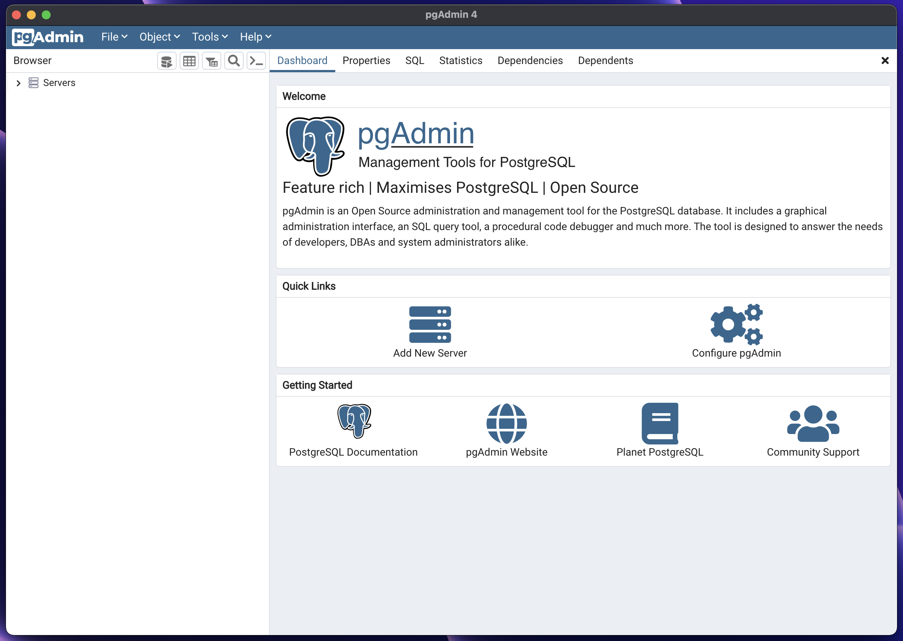
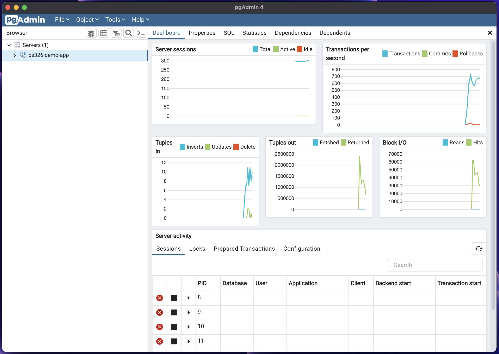
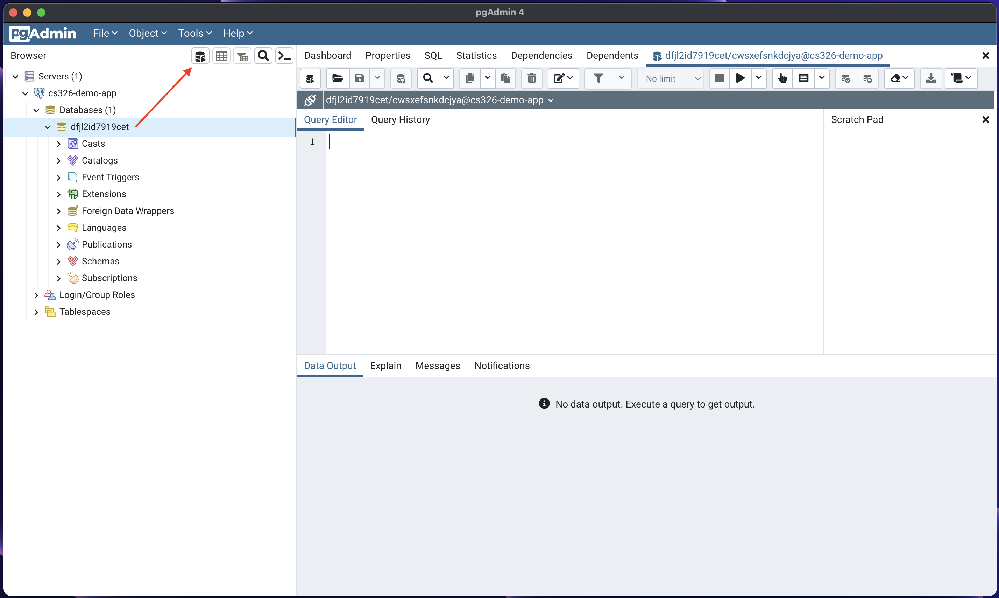

# Heroku and SQL

- [Heroku and SQL](#heroku-and-sql)
	- [Debugging a Node Application](#debugging-a-node-application)
	- [Relational Databases](#relational-databases)
	- [ACID](#acid)
	- [Create a Heroku App](#create-a-heroku-app)
	- [Add Postgresql to Heroku App](#add-postgresql-to-heroku-app)
		- [Adding Postgresql to Heroku App Using the Heroku Dashboard](#adding-postgresql-to-heroku-app-using-the-heroku-dashboard)
		- [Adding Postgresql to Heroku App Using the Heroku CLI](#adding-postgresql-to-heroku-app-using-the-heroku-cli)
		- [Database Credentials](#database-credentials)
		- [Using pgadmin](#using-pgadmin)
	- [Writing SQL Queries](#writing-sql-queries)
		- [Creating Tables and Inserting Data](#creating-tables-and-inserting-data)
		- [CRUD Operations](#crud-operations)
	- [Additional References](#additional-references)

## Debugging a Node Application

So far we have seen how to debug JavaScript code in the browser. The browser has an excellent debugging environment for debugging JavaScript code. It turns out that we can leverage the same tool for debugging Node.js code and the setup is rather simple. Consider the following [simple Express application](code/01-debugging-node):

```js
import express from 'express';

const app = express();

app.get('/', (req, res) => {
  res.send('Hello World!');
});

app.listen(3000, () => {
  console.log('Example app listening on port 3000!');
});
```

To install dependencies and run this code, you can use the following command:

```bash
npm install
npm run debug
```

The actual debug command that is used is `node --inspect-brk index.js` as you can see in the [package.json](code/01-debugging-node/package.json) file. This will start the node process and attach a debugger to it. To open the debugger in the browser you can visit [chrome://inspect/#devices](chrome://inspect/#devices). You will see something that looks like this:



You can then click on the *inspect* link under the **Remote Target* section. Once you do so it will bring up the debugger, which looks like this:



You can then create breakpoints and step through the code just like you can when you debug JavaScript in the browser. To start the application click on the "play" button in the top right corner.

## Relational Databases

At this point we have been using the filesystem to store our data. We have seen how to create a file and write to it. We have also seen how to read from a file. We have written functions to perform the basic CRUD operations and hooked them up into the backend part of our web applications. The benefit of all of this, of course, is persistency. It allows our web applications to ensure that the data they are working with is retained across shutdowns and restarts. This is important because users can make changes to the data and we want to ensure that those changes are retained.

Although the filesystem is a great way to store data, it is not the best way to store data. There are many other ways to store data and we will begin to explore them here. In particular, we will be using a database to store our data. We will start with the most common type of database, a [relational database](https://en.wikipedia.org/wiki/Relational_database).

Relational databases are a type of database that stores data in a table. A table is a collection of rows. A row is a collection of columns. A column is a single piece of data. It is very much like a spreadsheet of rows and columns, typically referred to as cells. There is much you can do with a relational database, but we will focus on the CRUD operations that we have seen so far.

We work with relational databases using the structured query language (SQL). SQL is a language that allows us to write queries to a database. These queries allow us to create, read, update, and delete data from a database. We introduce the very basics of SQL below. Before we get into the specifics of SQL we will first introduce the concept of ACID.

## ACID

Technically, we want systems that provide ACID properties (another acronym):



- **Atomic** - all operations are "all or nothing"
  - like the original "atomic theory"
  - they either **commit** or **abort**
    - one implementation: write everything to a separate buffer, see if anyone has written anything you've read; if so, throw away the buffer and retry. if not, copy in buffer.

- **Consistent** - we move from one "good" state to another

  - For example, only one record for each unique person, other invariants you need to enforce

- **Isolated** - it's like only one thing is happening at a time (but we can have multiple web browsers accessing the same server…)
  - it should be as if each action happens separately, one after the other
    - serializable
  - implemented with locks or other more complex mechanisms


- **Durable** - state survives a reboot or other failure because it's written to disk
  - "permanent", "persistent"

In SQL databases, these are referred to as *transactions* and there is a TRANSACTION BEGIN and TRANSACTION END you can use to make these updates safe (ACID).

## Create a Heroku App

1. To create a Heroku app, you need to have a Heroku account. You can create one for free at [heroku.com](https://heroku.com).

2. After you have an account, you might want to create an app. You can do this by going to the [Heroku dashboard](https://dashboard.heroku.com/account) and clicking on the **Create new app** button.

   

3. You will be asked to choose a name for your app. You can choose any name you want. You all need to pick a region. You can then click on the **Create app** button.

   

4. Next, you need to install the Heroku command line (CLI) tool. You can visit the [Heroku documentation](https://devcenter.heroku.com/articles/heroku-cli) to learn how to install the Heroku CLI. You can download an executable for windows environments. For a Mac, you need to install brew and then run a couple of commands as shown on the Heroku installation page.

## Add Postgresql to Heroku App

Postgresql is a relational database that is used to store data. Heroku provides a way to add Postgresql to your Heroku app. There are two ways we can add Postgresql to our app. The first way is to use the Heroku dashboard. The second way is to use the Heroku CLI.

### Adding Postgresql to Heroku App Using the Heroku Dashboard

1. Go to your Heroku dashboard and click on the **Resources** tab. Then start to type _postgres_ in the "Add-ons" search box. You will see the "Heroku Postgres" addon appear in the search results.

   

2. Click on "Heroku Postgres". You will be prompted for a "Plan name". You can select "Hobby Dev - Free". This is a plan that provides a free database with limited features. Accept this plan.

3. After you accept this plan, you will see the _Heroku Postgres_ addon appear in the list of addons.

   

   You can now click on the "Heroku Postgres" link to see the details of the addon. This will bring you to an overview page of your database. You can then click on the "Settings" tab. This will display a list of settings that will allow us to connect to the database through an external application.

### Adding Postgresql to Heroku App Using the Heroku CLI

If you prefer to use the Heroku CLI, you will first need to login to Heroku using the CLI like so:

```bash
heroku login
```

This will prompt you to open a browser to login to Heroku. Once you login through your browser, you will be all set to add Postgresql to your Heroku app from the CLI. You can do this by running the following command:

```bash
heroku addons:add -a <app-name> heroku-postgresql:hobby-dev
```

This will add the Heroku Postgres addon to your app. You can then display information about the Postgresql addon by running the following command:

```bash
heroku pg:info -a <app-name>
```

You can find additional documentation on the Heroku Postgres addon at [heroku.com/postgresql](https://devcenter.heroku.com/articles/heroku-postgresql) or type in the following from the command line to open the Heroku Postgres addon documentation in your browser:

```bash
heroku addons:docs heroku-postgresql
```

### Database Credentials

Now that you have a Postgresql database running on Heroku, you can connect to it using the credentials associated with the database. You can find the credentials by running the following command:

```bash
heroku pg:credentials -a <app-name>
```

### Using pgadmin

Postgresql provides a graphical interface called pgadmin. You can use pgadmin to connect to your database. You can download pgadmin for windows and Mac from the [pgadmin website](https://www.pgadmin.org/download).

After you have installed pgadmin, you can run the pgadmin application to connect to your database. You can do this by clicking on the "Add New Server" button.



You will need to enter your database credentials into the "Register-Server" dialog. You can find your database credentials using the CLI as shown above or through your app's dashboard on the Heroku website. The important credentials you need to enter are:

- **Host**: The hostname of the database.
- **Port**: The port of the database.
- **Database Name**: The name of the database.
- **Username**: The username of the database.
- **Password**: The password of the database.

You can enter this information under the "Connection" tab. You will also need to click on the "SSL" tab and set the "SSL mode" to "Require". After you enter in the credentials, you can click on the "Save" button. When you register your server, you can give it any name you wish. But, the rest of the credentials must be exact. Make sure you set the "Maintenance database" to the same database name as the "Database Name". You will also want to click on the "Advanced" tab and add the database name to the "DB restriction" field. If you do not do this, you will see thousands of databases.

After you have entered everything into the dialog, you can click on the "Save" button. This will bring up the dashboard for your database.



You can then drill down into the server, select the database, and then click on the _query tool_ icon to open the query tool. You can then run queries and see the results.



## Writing SQL Queries

There are a few basic SQL commands that you need to know. We will not cover SQL in detail here, only the basic operations that will allow us to implement CRUD operations.

### Creating Tables and Inserting Data

Here is an example of a couple of SQL commands that will create a table and insert some data into it:

```sql
-- Drop the people table if it exists.
-- We are just doing this to reset the DB each time.
drop table if exists people;

create table if not exists people (
	id varchar(30) primary key,
	name varchar(30),
	age integer
);

insert into
	people(id, name, age)
values
	('1', 'Artemis', 19),
	('2', 'Parzival', 17),
	('3', 'John', 30),
	('4', 'Mia', 22);
```

You can open [people-init.sql](code/sql/people-init.sql) directly and load it into the pgadmin query tool to execute the SQL commands.

### CRUD Operations

The following are the basic CRUD operations that you can perform on a database.

```sql
-- CRUD Operations

-- Create
insert into people values ('5', 'Caleb', 16);
insert into people values ('6', 'Hazel', 13);

-- Read
-- Get all rows from the people table.
select * from people;
-- Get all rows from the people table where age is < 20.
select * from people
	where age < 20;

-- Update
update people
	set age = 23
	where id = '4';

-- Delete
delete from people
	where id = '3';
```

You can open [crud.sql](code/sql/crud.sql) directly and load it into the pgadmin query tool to execute the SQL commands.

## Additional References

- [SQL Bolt - Learn SQL - Introduction to SQL](https://sqlbolt.com/lesson/introduction)
- [Heroku Postgres](https://devcenter.heroku.com/articles/heroku-postgresql)
- [PostgresSQL Tutorial](https://www.postgresqltutorial.com)
